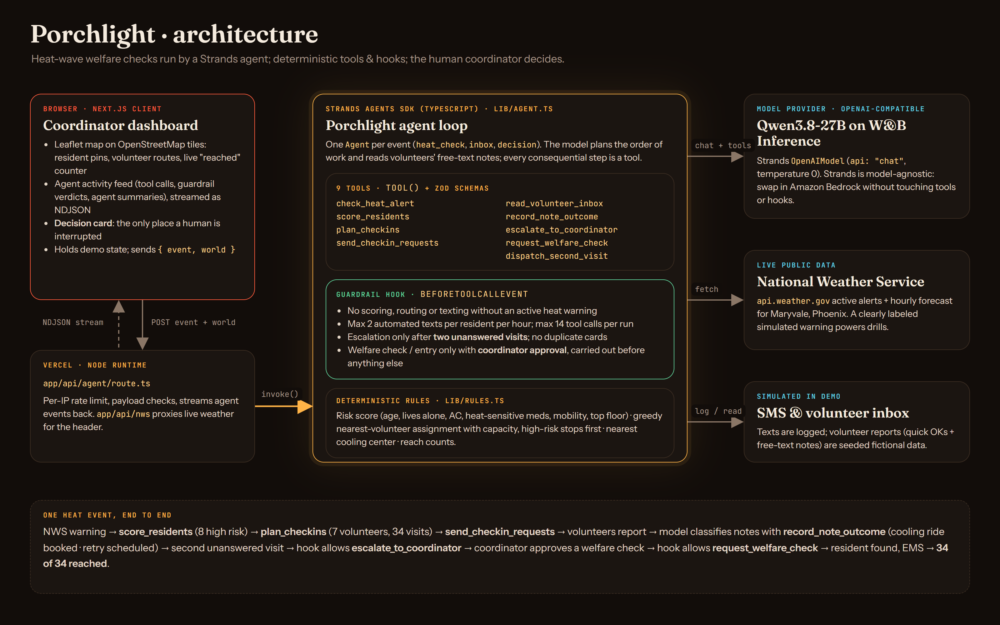

# Porchlight

**Porchlight is a Strands agent that runs heat-wave welfare checks for neighborhood mutual-aid groups.** When the National Weather Service issues a heat warning, it scores every enrolled neighbor's risk, sends the nearest volunteers to the highest-risk homes first, reads their reports, books cooling rides, schedules retries, and interrupts the human coordinator only when someone truly can't be reached. Every consequential step is a tool, and the safety rules are enforced in code by Strands hooks.

- **Live demo:** https://porchlight-bay.vercel.app (no login; takes about 2 minutes)
- **Pitch slides:** https://porchlight-bay.vercel.app/slides.html
- **Track:** Good Neighbor Agents · Agents for Humans Hackathon



## The problem

Heat kills quietly, indoors, and mostly people who are alone.

- In British Columbia's 2021 heat dome, **619 people died**. **98% died indoors**, **56% lived alone**, two-thirds were 70 or older, and only 7% had air conditioning. The coroners' review recommended identifying people who live alone and prioritizing them for home visits during extreme heat. ([BC Coroners Service, *Extreme Heat and Human Mortality*, 2022](https://www2.gov.bc.ca/assets/gov/birth-adoption-death-marriage-and-divorce/deaths/coroners-service/death-review-panel/extreme_heat_death_review_panel_report.pdf); [CBC News](https://www.cbc.ca/news/canada/british-columbia/bc-heat-dome-coroners-report-1.6480026))
- In Maricopa County, Arizona (Phoenix), **602 heat deaths were confirmed for 2024**. Among indoor deaths, 88% of homes had an air conditioner, but **70% of those units weren't working**. ([Maricopa County Department of Public Health](https://www.maricopa.gov/m/newsflash/Home/Detail/3222))

The people who can catch this in time are neighbors: mutual-aid groups, senior centers, churches. That usually means one volunteer coordinator with a spreadsheet, a phone, a few volunteers and a warning that gives them hours, not days. They have to work out who is most at risk, who is closest, who hasn't answered, and when a locked door means "call someone now". That triage is exactly what gets dropped when everyone is overwhelmed.

## Our solution

Porchlight takes the repetitive, time-critical coordination off the coordinator's plate and leaves them the one decision that needs a human.

1. **Watch.** `check_heat_alert` reads live NWS alerts and the hourly forecast from `api.weather.gov` for the neighborhood. For drills (and this demo), a clearly labeled simulated Extreme Heat Warning can be used.
2. **Triage.** `score_residents` applies fixed, explainable rules: age, living alone, no or broken AC, heat-sensitive medications (diuretics, beta-blockers, anticholinergics, antipsychotics), limited mobility, top-floor unit. `plan_checkins` assigns each home to the nearest volunteer with capacity, highest risk first, and orders each route so high-risk stops come first. `send_checkin_requests` texts everyone (simulated SMS).
3. **Follow up.** Volunteers tap "OK" or send a free-text note. Quick OKs are recorded automatically. **The model reads the notes** ("his AC unit is dead and it's 96 inside") and classifies them with `record_note_outcome`; code then books the nearest cooling center or schedules a retry visit.
4. **Escalate only when it matters.** After **two unanswered visits** to the same person, `escalate_to_coordinator` puts one decision card in front of the human, with the facts that matter.
5. **Close the loop.** The coordinator chooses a police welfare check or a second volunteer entering with a neighbor's key. The agent carries it out (`request_welfare_check` / `dispatch_second_visit`), reads the follow-up report and tracks everyone to "reached".

In the demo drill, 7 volunteers reach **34 of 34** neighbors in 100 simulated minutes: one cooling ride booked, one retry resolved, and one woman found on her kitchen floor in time. The coordinator makes exactly one decision.

## How we use the sponsors

### Strands Agents SDK (TypeScript) is the core of the product

| What | Where |
| --- | --- |
| `Agent` built per event (`heat_check`, `inbox`, `decision`) with a system prompt and 9 tools | [`lib/agent.ts`](lib/agent.ts) (`runPorchlight`) |
| Tools defined with `tool()` + zod schemas: `check_heat_alert`, `score_residents`, `plan_checkins`, `send_checkin_requests`, `read_volunteer_inbox`, `record_note_outcome`, `escalate_to_coordinator`, `request_welfare_check`, `dispatch_second_visit` | [`lib/agent.ts`](lib/agent.ts) |
| **Guardrails as a `BeforeToolCallEvent` hook** (`agent.addHook`), which cancels a tool call with a reason the model can read | [`lib/agent.ts`](lib/agent.ts) (`check`) |
| Model: `OpenAIModel` (`api: "chat"`, temperature 0) against an OpenAI-compatible endpoint | [`lib/agent.ts`](lib/agent.ts) |
| Deterministic rules the tools call (risk score, routing, cooling center, counts) | [`lib/rules.ts`](lib/rules.ts) |
| Tool calls, guardrail verdicts and agent text streamed to the UI as NDJSON | [`app/api/agent/route.ts`](app/api/agent/route.ts), [`components/Porchlight.tsx`](components/Porchlight.tsx) |

The guardrail hook enforces these rules no matter what the model decides:

- No scoring, routing or mass texting without an active heat warning.
- At most 2 automated texts per resident per hour, and at most 14 tool calls per run.
- `escalate_to_coordinator` is allowed only after two unanswered visits, and never twice for the same person.
- `request_welfare_check` and `dispatch_second_visit` require a matching coordinator approval. Reading new reports is blocked until an approved action has been carried out.

Every verdict appears in the activity feed ("Guardrail passed · two unanswered visits"), so the coordinator can see why the agent was allowed to act.

**Division of labor:** the LLM decides the order of work, reads messy human notes and writes short status updates for the coordinator. Code does everything with consequences. That makes Porchlight's behavior predictable enough to trust with vulnerable neighbors.

### AWS

Porchlight is built on the AWS open-source Strands Agents SDK. It is **not** deployed on Amazon Bedrock AgentCore for this submission; it runs on Vercel. Because Strands is model-agnostic, moving to Amazon Bedrock is a model swap (`OpenAIModel` → `BedrockModel`) with no change to tools or hooks. Each agent run is stateless (the world state travels with the event), which fits AgentCore Runtime's invocation model.

## Try it (testing instructions for judges)

1. Open https://porchlight-bay.vercel.app. The header shows **live** NWS conditions for Maryvale, Phoenix.
2. Click **Simulate Extreme Heat Warning** (or **Run live NWS check**; if there is no live heat alert, the agent stops and keeps watching). Watch the Strands tool calls and guardrail checks in the activity feed. Pins turn red, orange and yellow by risk and volunteer routes draw on the map.
3. Click **Fast-forward · volunteer reports come in** twice. Hover pins for each person's risk factors and status.
4. When the **decision card** appears for Dolores, pick either option. Her pin goes green and the counter reaches **34 of 34**.
5. **Reset** (top right) starts over. Each agent run takes about 5–20 seconds.

## Run locally

Requires Node 22+ and pnpm.

```bash
pnpm install
cat > .env.local <<'EOF'
OPENAI_BASE_URL=https://api.inference.wandb.ai/v1   # any OpenAI-compatible endpoint
OPENAI_API_KEY=your-key
OPENAI_MODEL=Qwen/Qwen3.8-27B
EOF
pnpm dev   # http://localhost:3000
```

Any OpenAI-compatible provider whose model supports tool calling works (for example OpenAI itself: drop `OPENAI_BASE_URL` and set `OPENAI_MODEL`).

## Project structure

```
app/api/agent/route.ts   streaming agent endpoint (rate limited)
app/api/nws/route.ts     live weather for the header
lib/agent.ts             Strands agent, tools, guardrail hook
lib/rules.ts             deterministic risk scoring, routing, limits
lib/seed.ts              fictional residents, volunteers, volunteer reports
lib/nws.ts               api.weather.gov client
components/              map (Leaflet + OpenStreetMap) and dashboard
public/slides.html       4-slide pitch deck
docs/architecture.*      architecture diagram (HTML source + PNG)
```

## Honest notes

- **All people in the demo are fictional.** Pin locations are randomized points in Maryvale, Phoenix, not real addresses, and cooling center names are illustrative. Weather is live from api.weather.gov unless marked "Simulated drill". SMS and the police request are simulated; volunteer reports are seeded so the demo is repeatable.
- Built from scratch during the hackathon submission period. [Claude Code](https://claude.com/claude-code) was used as a coding assistant; narration in the demo video was generated with ElevenLabs.
- Map data © OpenStreetMap contributors.

## License

[MIT](LICENSE)
